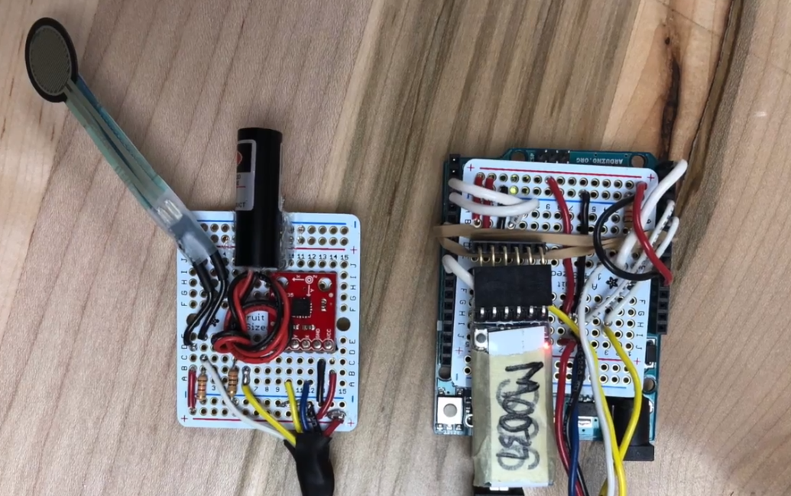

## Background
This was my very first electronics project! I worked on it with Jayden Lee in Introduction to Electrical and Systems Engineering. Flik aimed to give users a method for "Advancing Presentations with a Flik of Your Wrist." That is, it's a new way to control powerpoint presentations.

## The Electronics
This project contained two modules: the user module and the computer module. The user module consisted of an accelerometer, an Arduino Uno and an HC-05 Bluetooth Module. This module acted as the master and communicated with the computer module over Bluetooth. The computer module also had an HC-05 Bluetooth Module, but was built with an Arduino Leonardo as it can interface with the keyboard to "press next."

<em>Two Parts of the User Module</em>

We used the accelerometer to determine the threshold for advancing a slide. However, we had two problems: one flick was advancing multiple slides and random noise would also advance slides. A moving average filter was used to solve the second problem, ensuring only a series of values crossing the threshold would be considered a flick. After a flick was detected, the average had to settle below another threshold before another flick could be registered, solving the first problem.

The user module also had a pressure sensor by the thumb that shines a laser diode when pressed, allowing Flik to be used as a laser pointer. Using pulse width modulation, the laser varied its brightness depending on how hard the user pressed on the sensor.

## Mechanical Considerations
The Arduino Uno was quite large, so the module was broken into two. The accelerometer, laser diode, and pressure sensor were soldered onto a perf board which was then sewed into a glove the user wears. Wires ran from the glove to an enclosure housing the rest of the components.

See it all in action in this short clip from demo day!

<iframe width="560" height="315" src="https://www.youtube.com/embed/NioVmwKPhow" frameborder="0" allow="accelerometer; autoplay; encrypted-media; gyroscope; picture-in-picture" allowfullscreen></iframe>
