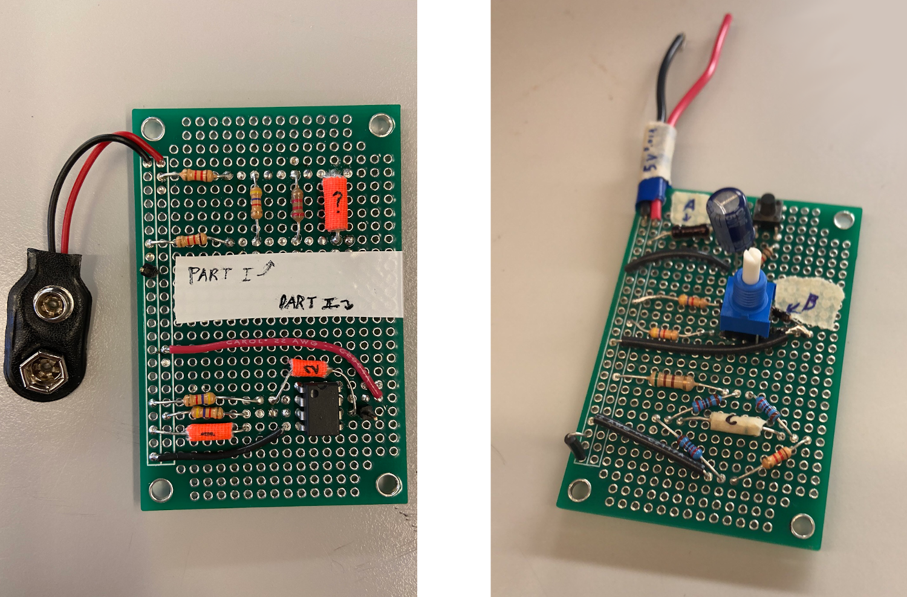

Here are some of the other miscellaneous projects that I worked on at
Penn. They are listed roughly in reverse chronological order. This page is 
still a work in progress! 

## Science Olympiad at UPenn
Technically not a course, but I created these labs for <a href="http://pennscienceolympiad.org/" target="_blank" rel="noopener noreferrer"> Science Olympiad at UPenn</a> (SOUP). During the lab portion of the circuit lab event, high school students were supposed to analyze circuits using a multimeter and a stopwatch in order determine the values of the mystery resistors. These circuits include operational amplifier configurations, RC circuits, and various resistor configurations. It's club policy to only release questions to attendees, but pictures of the circuits are shown below.

## Synchronous FIFO Queue - VLSI
This was the final project for Circuit-Level Modeling, Design and Optimization for Digital Systems. It was designed in Electric VLSI and I worked with Caroline Leng. The queue was to hold 4bit wide elements and have a maximum capacity of 16. The project consisted of a few parts.

First a 6T SRAM memory cell was designed. Combining these cells with precharge circuitry and column drivers made from tri-state buffers, a 64bit SRAM was created. D Flip-Flop registers were added to synchronize inputs and outputs, and a decoder was added to specify the memory location to be accessed. Finally, counters were added to move the pointers tracking the front and back of the FIFO on each enqueue or dequeue.

## Snake PCB - Java

    

        
 This project was a variation of the classic game Snake, themed as a two layer PCB. The snake can travel on both the top and bottom layers, and objects must be on the same side to interact. Yes, that means the snake can cross over itself! The ICs give 1 length and increase the score by 1, while capacitors give 1 point but increase the score by 3. However, the capacitors disappear so be quick!
        

    

    

        
    

## Other Projects - To Be Documented
- CIS 550, Travel Trivia - a web app with a SQL db, for answering local trivia questions as one travels across the US
- CIS 350, BikeAround - a web and android app with a Mongo DB Database for biking around a city
- CIS 541, Adaptive Cruise Control Simulator, Demonstrating RTOS
- ESE 350, other miscellaneous embedded projects
