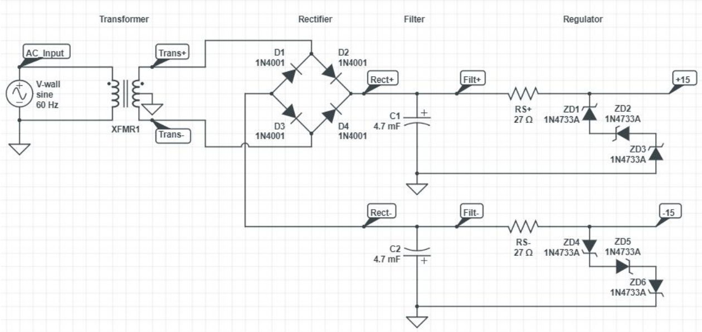
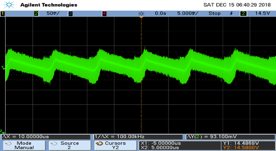
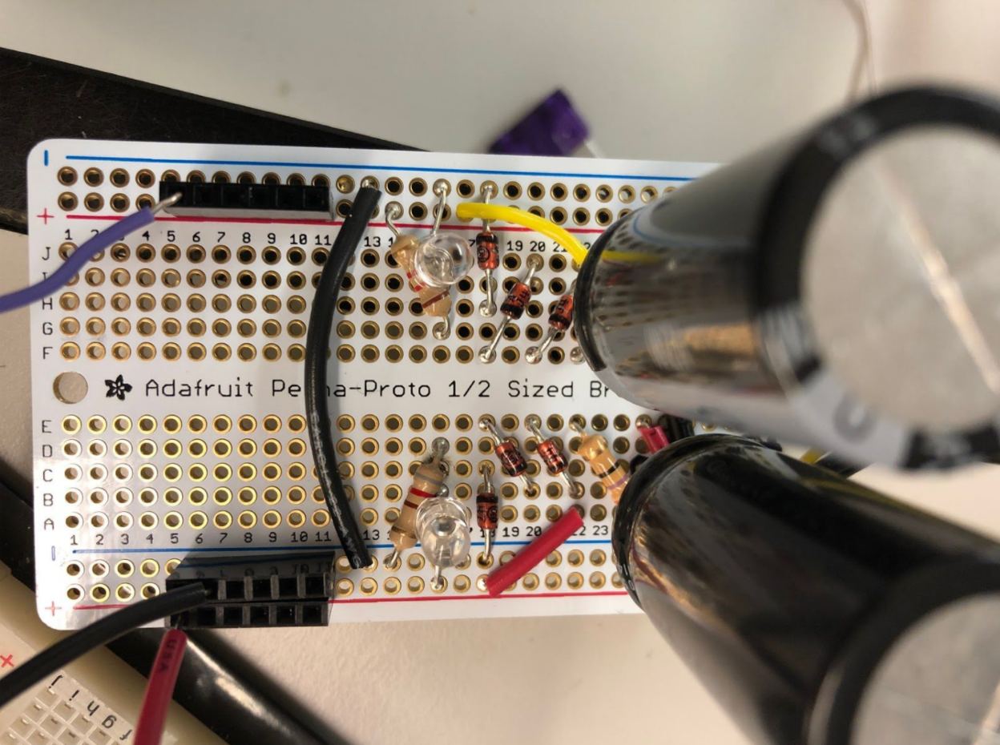
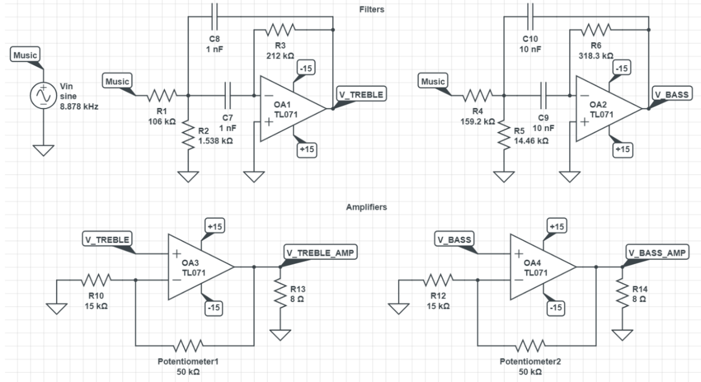
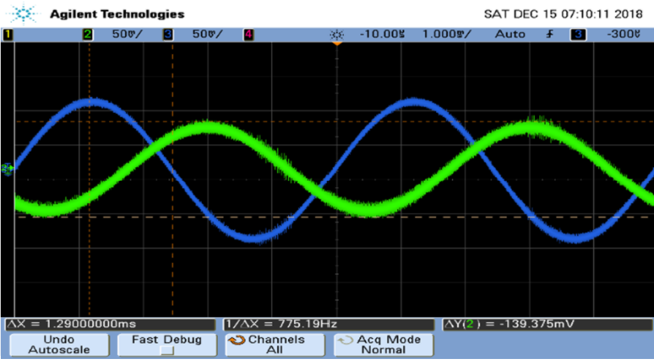
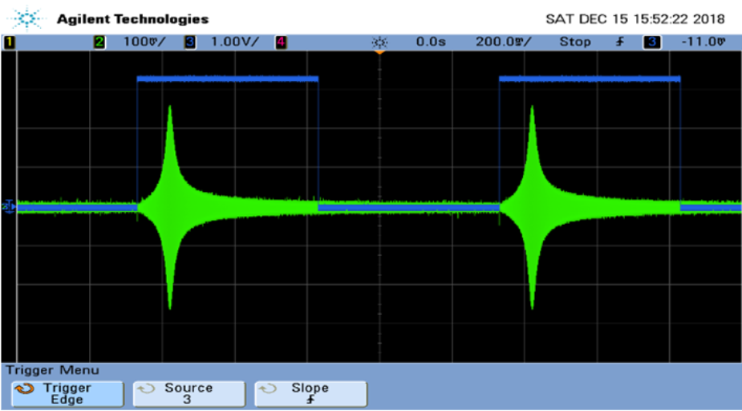
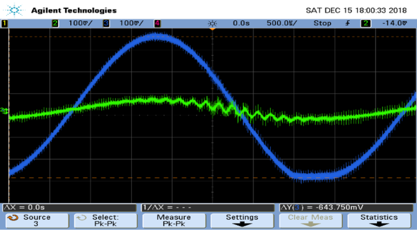
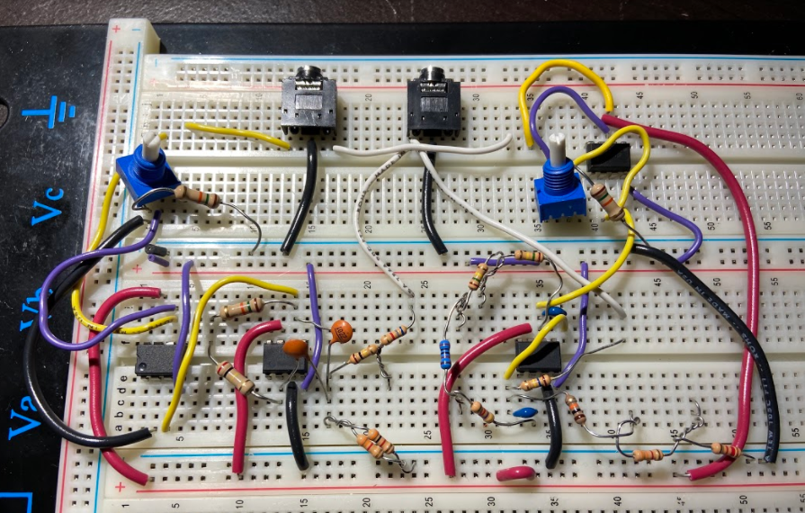

## Background
This was my final project in Electrical Circuits and Systems, a course covering digital and analog circuit analysis. The goal of this project was to create an audio filter which can independently tune the volume of the treble and base. As a smartphone dock, another goal was for the project to be powered from an AC wall outlet. I worked on it with Fatih Ozer.

## Power Supply Design
The goal was to design a power supply that outputs +/- 15V with less than 2% ripple at the expected load. The circuit consisted of four sections: a transformer, a rectifier, a filter, and a regulator. A center tapped transformer with a turn ratio of 5.17 stepped the input voltage of 120 Vrms to 11.61 Vrms for both output terminals. These outputs were connected to a full-bridge rectifier to capture both the positive and negative parts of the waveform. Large output capacitors make up the filter to minimize voltage ripple, and three 1N4733A zener diodes regulate the voltage to +/-15V. The design is shown below:

The power supply was first simulated, and then tested under the expected load of 2.5k (10k per TL071 operational amplifier). The voltage ripple measured, pictured below, was 0.32%.

With that, the power supply was finished and soldered onto a perf board. LEDs were added for safety, indicating when the power rails were live.

## Filter Design
The filters were designed using the Multiple Feedback Bandpass Filter topology. A bandpass filter was chosen to define a more precise range of values as our treble and our base. Thus, the base filter had a central frequency of 245Hz and cutoff frequencies of 195Hz and 295Hz. The treble filter had a central frequency around 8870Hz, with cutoffs of about 8120 Hz and 9620 Hz. When choosing values to reach these cutoffs, gain was not prioritized as the output of these filters were being fed to an amplifier. A non-inverting configuration was used, with a potentiometer to tune the volume. The schematic for this part is shown below.  

Again, the filters were simulated and Bode plots were created for both of them. A few test frequencies were plotted as well, to verify that the cutoff frequency waves had amplitudes 0.707 the amplitude of the central frequency. These tests were then repeated on the actual hardware using a function generator. A few sample screenshots of the oscilloscope are included below. Note that these were taken before the amplifier.

<em>At 200Hz, the output (green) has a Vpp of 139.38mV, which is 0.707 the central frequency's as expected. The central frequency had an amplitude matching the input's (blue).</em>

<em>The treble filter's Bode plot matches the simulation.</em>

<em>A 245Hz test signal passes through the base filter (blue), but is suppressed by the treble filter (green).</em>

## Final Integration
The final step was to test the system with some songs. Sadly, I can't find the recording of our final demo, but here is a picture of the circuit.

