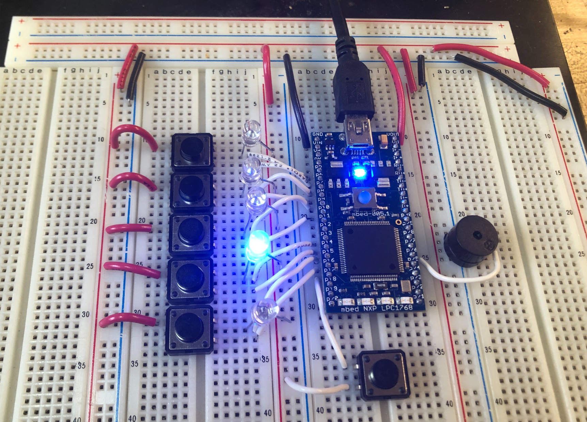
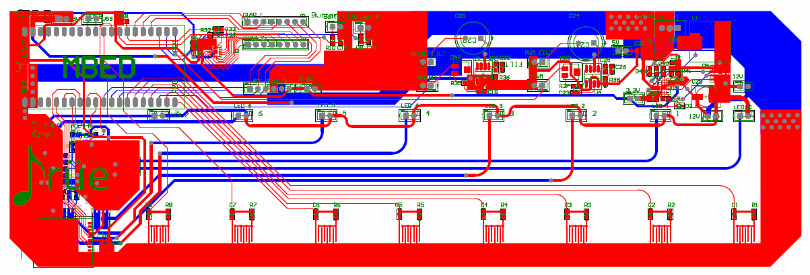

## Background
Drüe is a portable mini-keyboard designed to encourage children to turn
away from computer screens and help them develop motor skills, hand-eye
coordination, and memory. Although it aims to use full-size keys, it
covers only one octave, making it easier for children to use it to practice.
Drüe has a few modes: a wack-a-mole style game where the child must
press the key that lights up as fast as possible, a memory-based game
where increasingly longer strings of keys would be lit up that the child
has to repeat back (like Simon), and a free-play piano mode.

I started this project with my partner Mirko Ren using an mbed as the final
project for Penn's embedded systems lab course.

## Alpha
For the alpha prototype, the very basic version of Drüe was created. In
place of piano keys that light up, push buttons and LEDs were used. The
main problem we encountered was that we needed to debounce the
buttons. They had a high frequency contact bounce that led to buttons
being read as pressed multiple times. We also wanted to implement the
buttons such that if held down, the tone plays once like a real piano. For
now, the tone was being generated by sending each notes' frequency to
the buzzer, but we wanted a more realistic sound.

## Beta
For the beta prototype, the number of buttons expanded to eight keys to
cover the C major scale. Each button also had an RC circuit as a basic
form of debouncing. At this point, there weren't enough pins so an I2C
IO expander was implemented. To mimic a more realistic sound, we chose to
go the route of playing audio samples from an SD file.

## PCB - First Iteration
From here, we decided to move forward with a custom PCB. The main
addition were mosfets used to drive LED strips. These LED strips would sit
inside the piano keys to light them up. In order to power Drüe off a single
power source, a buck converter was also added to drop the input voltage
down to 5V. To mimic the feel of an actual keyboard, rubber key contacts
made for keyboards were implemented.

Below is a video of the first time these components were used together.
Drüe is in free-play mode, but not using the SD card audio samples.

<iframe width="560" height="315" src="https://www.youtube.com/embed/Mrt4mhsLpvQ" frameborder="0" allow="accelerometer; autoplay; encrypted-media; gyroscope; picture-in-picture" allowfullscreen></iframe>

At this stage, we added back wack-a-mole mode but ran into problems.
More specifically, we found that pressing a key in free play mode would
cause Drüe to shuffle back to wack-a-mole. We believed the problem
stemmed from lack of capacitance on the lines powering the LED strips. That
is, the sudden pull in current was dipping the voltage enough that the
mode changing pin was triggered.

Unfortunately, we weren't able to finish the project within this course. I
hope to one day revisit this project to finish it!
