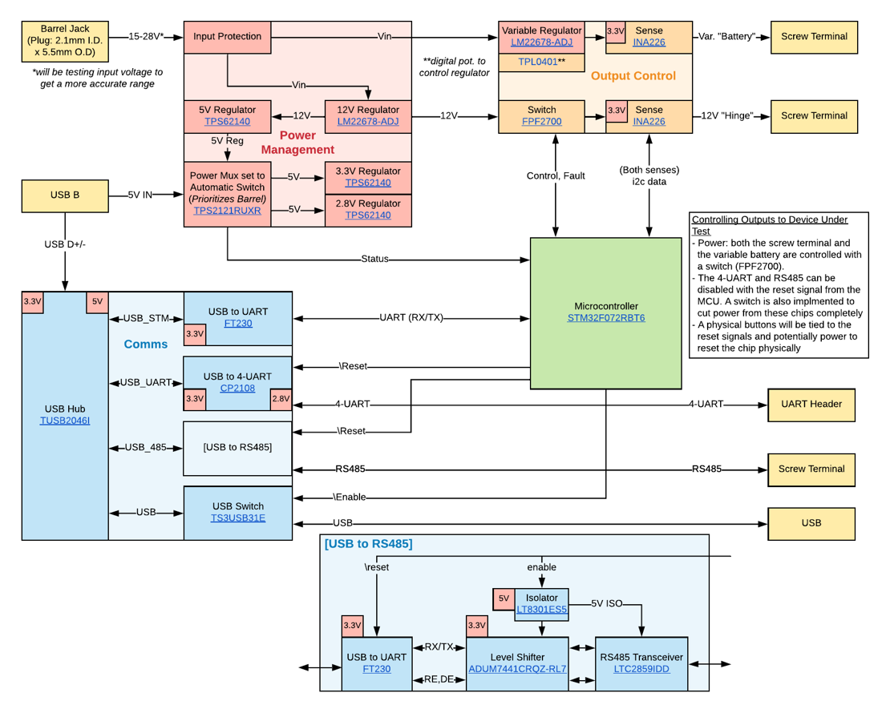

## Background

I designed this board for an internship program at <a href="https://www.latch.com/" target="_blank" rel="noopener noreferrer">Latch</a>. Broadly, this board
(playfully nicknamed "Blueberry") had two goals. First, the old testing
station on the manufacturing line was messy as it contained multiple
boards. Blueberry aimed to simplfy the station by consolidating all the
functionality onto one board. Second, Blueberry was to be a single tool
that the firmware team could use to debug the PCBs in each product.

## Design
To establish the requirements for this project, I met with the firmware
and manufacturing teams. I determined the communication protocols needed
to interface with the products and specifications for powering the device
under test. Using this information, I drew the following diagram.

The main input to the board is USB, which connects to the TUSB2046I, a
4-Port USB hub. One hub output is translated to 4 UART streams on a
header and another to isolated RS485. These are the main outputs used to
communicate with products. A third hub output interfaces with the
STM32F1 microcontroller and the last is just outputted for the user.

The second input is a barrel jack for power. The TPS2121 power mux
ensures that although the barrel jack isn't necessary for operations
mentioned in the previous paragraph, power will be drawn from it
instead of the USB input when possible. The primary use for this input,
though, is to power the device under test. Blueberry has two power
outputs: 12V and a programmable voltage. The power consumption for these
outputs is monitored with the INA226.

## Bring-Up Testing
With the board in hand, I performed a series of bring up tests to verify
basic operation. Using an oscilloscope, I checked that the power supplies
were outputting the expected voltages and that the power mux operated as
expected. Using PuTTY, I checked the operation of the UART streams.

At the conclusion of my internship, I wrote a list of features that required
code to be tested and passed the project on to the firmware team.

