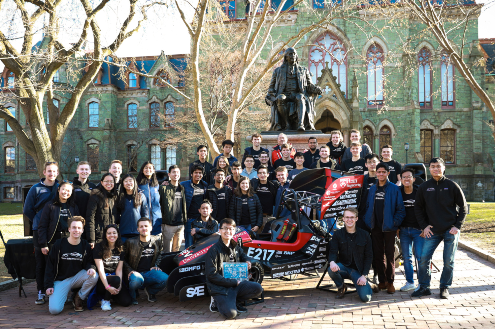
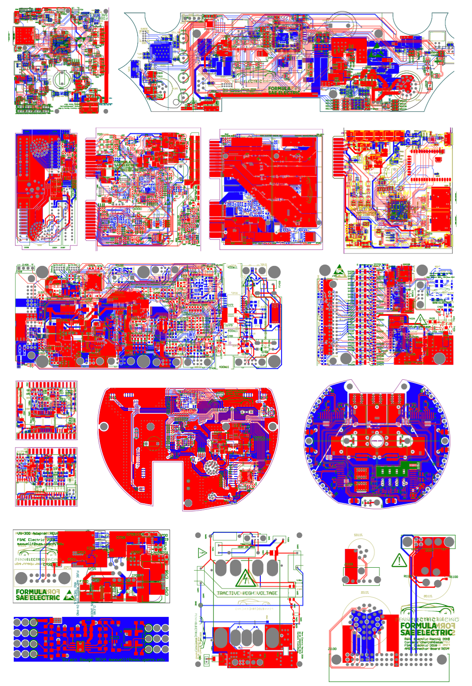
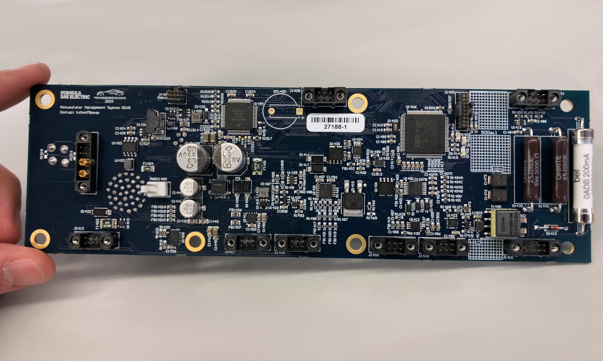
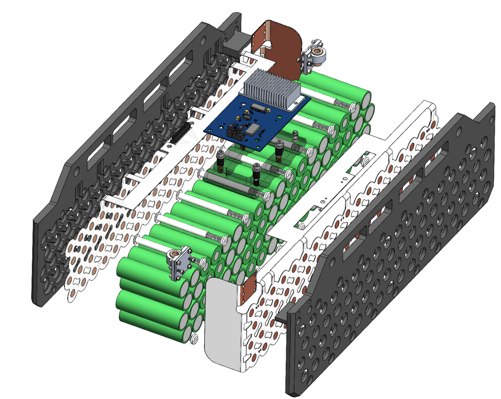
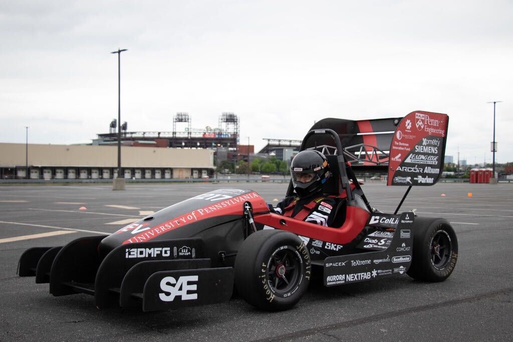

## The Team
Penn Electric Racing is a student run engineering team that competes in the
Formula SAE Electric. We've historically built electric racecars that
rank top three internationally at competitions such as FSAE Lincoln and
have held the record for fastest acceleration time. More information about the team can be found on
<a href="https://www.pennelectricracing.com/" target="_blank" rel="noopener noreferrer"> our website!</a>

---
## Responsibilities

    

        
 The hardware subteam designs, reviews, and tests
            about 15 custom four-layer PCBs each year. Our designs include
            a LCD dashboard, an e-fused power distribution unit, and
            a powertrain control module.
        

        
 As the electrical lead, I managed the timelines for all of the
            boards. However, I worked most closely with designing the
            Battery Management System. Thus, I included more details
            about this system below.
        

    

    

        
        <!-- <figcaption class="caption">Board Gerbers (2018)</figcaption> -->
    

I've also fostered team growth through documenting our designs on
Confluence, developing a new member curriculum, and speaking at
recruiting events, such as info sessions or club fairs.

")

---
## Battery Management System

CONTENT IN PROGRESS :) :)

    

        
        <!-- <figcaption class="caption">BMS CAD</figcaption> -->
    

    

        
    

    

    

    

        
    

---

