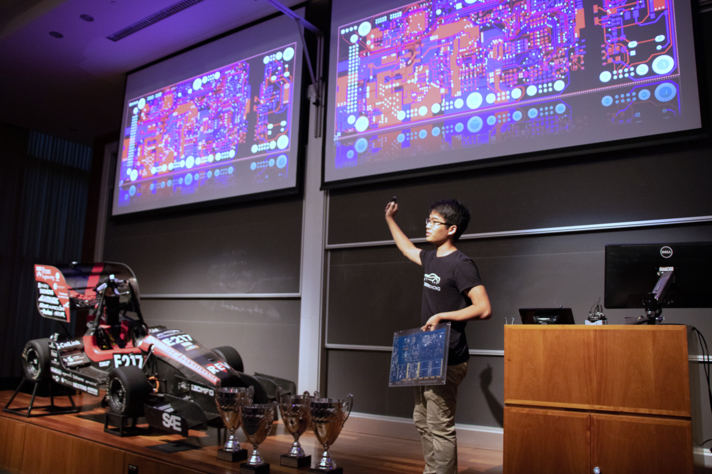
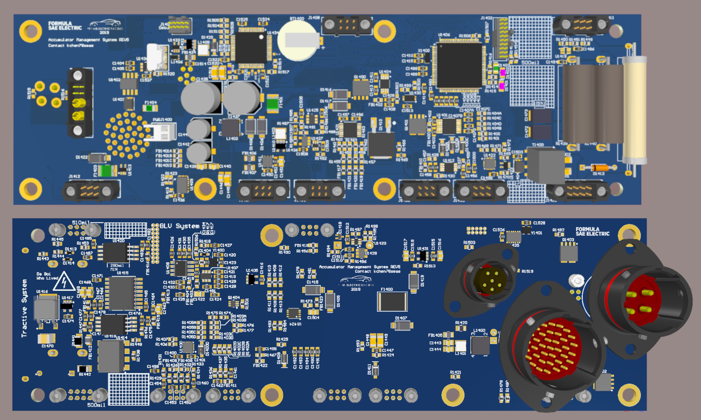

## The Team
Penn Electric Racing is a student run engineering team that competes in the
Formula SAE Electric. We've historically built electric racecars that
rank top three internationally at competitions such as FSAE Lincoln and
have held the record for fastest acceleration time. More information about the team can be found on
<!-- <a href="https://www.pennelectricracing.com/" target="_blank" rel="noopener noreferrer"> our website!</a> -->

---
## Responsibilities

    

        
 The hardware subteam is responsible for designing and testing
            about 15 custom four-layer PCBs each year. These boards include
            a LCD dashboard, power distribution unit with e-fusing, and a
            powertrain control module.
        

        
 As the electrical lead, I drove the timeline for and reviewed
            all of the boards. However, I worked most closely with designing
            the Battery Management System. More details are included below.
        

        
        <figcaption class="caption">New Member Info Session (2019)</figcaption>
    

    

        
        <figcaption class="caption">Board Gerbers (2018)</figcaption>
        
 

        
 I've also help foster team growth through writing Confluence
            pages, developing a new member curriculum, and speaking
            at club recruiting events.
        

    

---
## Battery Management System

CONTENT IN PROGRESS :) :)

    

        
        <!-- <figcaption class="caption">BMS CAD</figcaption> -->
    

    

        
    

    

    

    

        
    

---

