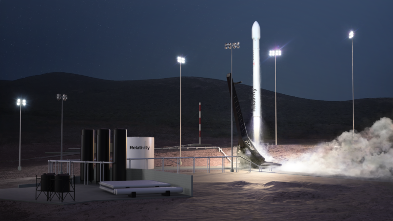

I designed this board for an internship program at <a href="https://www.relativityspace.com/" target="_blank" rel="noopener noreferrer">Relativity Space</a>. It was an early revision of the low voltage battery management system (BMS) for their first rocket, Terran 1. While I was lucky to be able to work on projects within the rocket itself, I unfortunately can't get into specifics as a result.

Broadly speaking, the goal was to design a BMS that ensured Terran 1's low voltage batteries were being charged and discharged safely. These batteries powered most of the avionics on both stages of the rocket, so reliability and current carrying capacity were huge priorities. 

When working on this project, I followed a very methodical process. I started by writing a spreadsheet listing all the project requirements along with how each one would be verified. Then, I drafted an architectural block diagram and performed parts selection. After all of the planning was done, I finally worked on the schematic and layout. This was my first time routing a board with more than 6 layers, so it was a really exciting experience. 

_More Content TBD_
