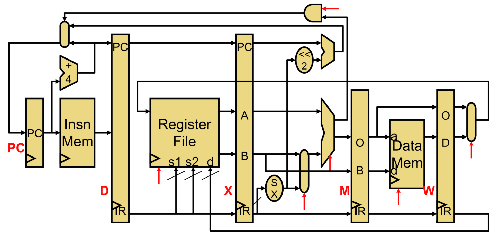
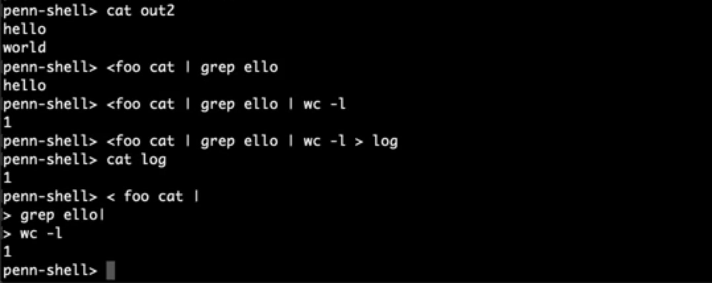

This page details a few projects I worked on in my Computer Engineering 
courses, related to computer architecture and operating system design. 

## Little Computer 4 (LC4) - Verilog, C
LC4 was a basic instruction set architecture (ISA), based on <a href="https://en.wikipedia.org/wiki/Little_Computer_3" target="_blank" rel="noopener noreferrer">LC-3</a>, developed for use as an educational tool at Penn. In Introduction to Computer Architecture, the final projects were to build an assembler and compiler for this ISA written in C. The compiler was written for a made up language called J, loosely inspired by Forth. Although some of the commands were just tedious (assembly for PLUS, MINUS, MUL, etc can only be so different), the assembly for function definitions and IF/ELSE were more interesting! Functions required careful stack handling, where the caller's frame pointer and address had to be stored, and IF/ELSE required clever labels since they could be nested.

In the follow up class, Computer Organization and Design, a few processors were designed using Verilog that could run LC4. We started with a basic processor without any acceleration techniques, but kept adding to it until the final project had a superscalar pipelined datapath, with 2 pipelines and 5 stages. The pipeline stages were Fetch, Decode, eXecute, Memory, and Writeback, based on MIPS. 

The CPU was fully bypassed: MX allowed data just calculated by the execute stage to be used immediately, WX allowed for data from 2 cycles ago (executed or loaded) to be used immediately, and WM allowed for data loaded from memory to be stored. Only load-to-use case needed a stall.  The processor alsy "predicts" branches as not taken, flushing on mispredictions rather than always stalling. While the processor did have 2 pipelines, the performance increases were limited. For example, if one execute used the output of another execute, they couldn't be run in parallel. Our design could also only handle one load/store to memory at a time so only one pipeline had that capability. 

This was my favorite computer science final project!

## PennOS and PennShell - C, Linux
At around 15,000 lines of code, PennOS was the largest software project I, with a team of 4 people, worked on at Penn. It was a program that mimicked a UNIX-like operating system, running as a guest OS within a single process on the host OS. PennOS consisted of a priority scheduler, a FAT file system, and a custom shell for user interactions called PennShell. 

My partner and I focused on the kernel side of the project, with him tackling the priority scheduler and me writing UNIX-like kernel space and user space functions for use with PennShell. To mimic the user vs kernel separation, I wrote functions a user could use to spawn/wait/kill new "threads," although under the hood, the kernel had its own functions to manage these "threads." The priority scheduler was then responsible for scheduling when these "threads" were able to run. PennOS also had to be able to catch signals like SIGTERM and mimic the behavior accordingly, rather than quitting. 

After integrating with the filesystem side of the project, I also worked on various commands typically found in UNIX shells, such as fg, bg and nice. 

To elaborate on PennShell, it was a prior project in the course in which my partner and I developed a custom Linux shell similar to bash. Some features included were foreground and background processes, input and output file redirection, n-stage pipelines, and job control. The test snippet above demonstrates pipelining and redirection. When used with PennOS, the Linux system calls were swapped out for our own user level functions. 