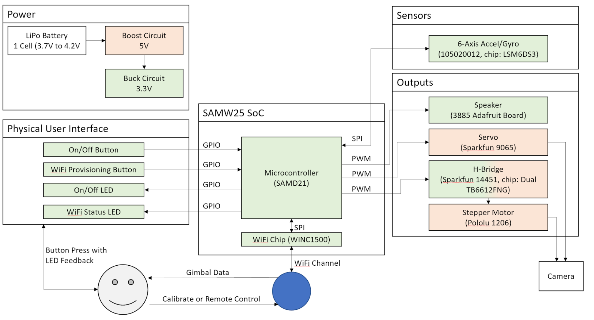
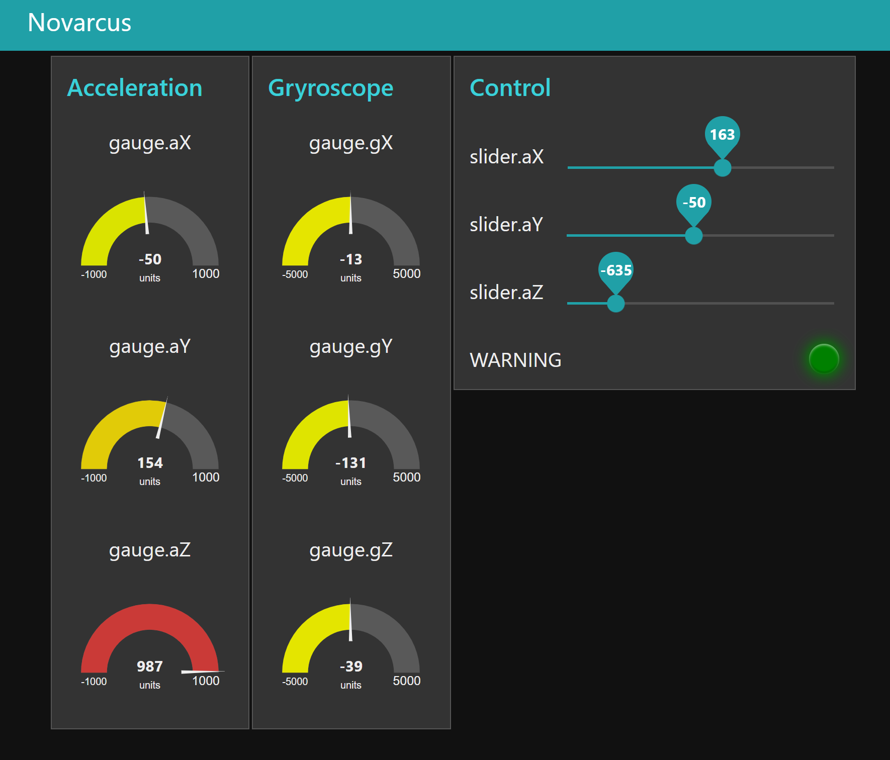

## Background 

Novarcus is an affordable one-axis camera gimbal, used to stabilize footage from a light-weight camera such as a GoPro. Novarcus has the capability to receive firmware updates over WiFi, report its current status to a NodeRed server, and (after a future firmware update) be controlled remotely. Another planned feature was a second axis for stabilization. 

I worked on this project with my partner Andy Zhao for Penn's IoT edge computing course. 

## How it Works

Novarcus uses a 6-axis IMU to measure data from an accelerometer and gyroscope, and sends that data to our Node Red server for display. The data is sent as json packets over MQTT to a public broker, before being received by our server. These measurements are also used to calculate which direction the servo needs to spin in order to reorient the IMU. If the IMU is not able to be reoriented, a warning flag is thrown. In our prototype, we are simply incrementing by a set step in order to reorient the IMU, though a future firmware update should aim to implement a PID controller. 

## Hardware Design 

We started the hardware design with a block diagram in order to set the required microcontroller peripherals. We populated the block diagram with selected parts then chose regulators which met the power requirements of all the components chosen. To control the camera's rotation, we opted to use a servo for more precise positioning; however, the servo was limited to 180 degrees of movement. Thus, we added a stepper motor to our design as well. Due to course constraints, the microcontroller and general board shape were predetermined. We were still responsible for schematic and layout design though, and used Altium. 

## Firmware Design 

On the device side, we used freeRTOS to run Novarcus as 3 separate tasks: a WiFi thread dedicated to communications with the web, a main control thread for stabilizing the camera, and a command line interface thread. Queues are used for sending messages between threads. For instance, the main control thread passes sensor data to the WiFi thread to display to the server. Novarcus was also designed with a bootloader, downloading a new firmware image when an "update available" flag was set. After downloading the new image, the CRC is calculated and the flag is cleared only if the calculated value is expected. Otherwise, the chip resets and the bootloader would try again. The command line interface was primarily used for debugging sensors, although additional commands such as resetting the device or checking for updates were added. Admittedly we didn't use the command line interface to its full extent, but had wanted to add the capability to remotely control Novarcus.

## Software Design 

The server, UI pictured above, was designed using a tool called NodeRed to simplify software development for this portion of the project. Both Novarcus and the server connected to the same MQTT public broker and communicated using json packets. The server was responsible for displaying measurements from the 6-axis IMU as well as a warning LED for when the camera tilted beyond correctable range. The server could also send data back to Novarcus, which we planned to use to remotely control the device. Our final demo, which we recorded due to a remote-learning semester, is included below: 

<iframe width="560" height="315" src="https://www.youtube.com/embed/9OBa2l3fEIs" frameborder="0" allow="accelerometer; autoplay; encrypted-media; gyroscope; picture-in-picture" allowfullscreen></iframe>